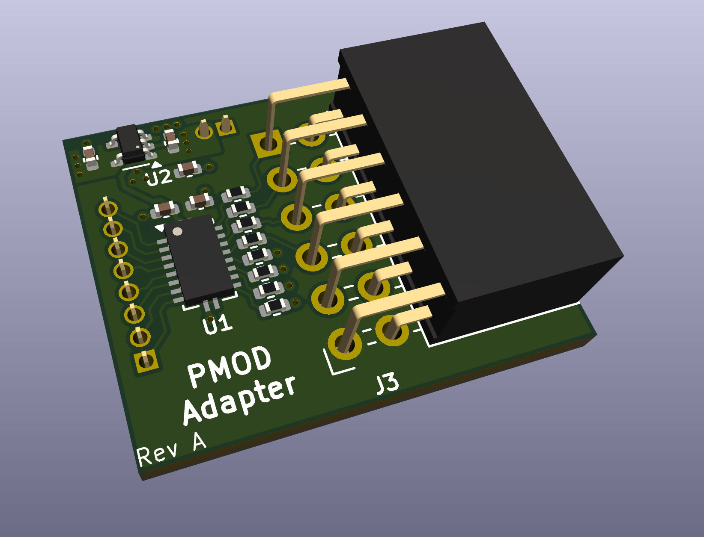

# Rowan University Baja DAQ System
This repository contains all files related to the Data Acqusition (DAQ) system for Rowan University's Baja SAE 2025-2027 team.

All files in this repository are licensed under the [GNU General Public License Version 3.0](LICENSE).

## Components
Click these links to quickly navigate to one of the several components of the DAQ system.
Each link has more detailed information about the design and use of the component.
 - [CAN Module](can-module): Main building block of design, connects other devices together over the CAN bus.

   

 - [Accelerometer Board](accelerometer-board): Contains a 6-axis intertial measurement unit to measure linear and rotational acceleration.

   

 - [SD Card Board](sd-card-board): Contains a microSD card slot to log data.

   

 - [Wireless Communication Unit](comm-unit): Contains a LoRa module to wirelessly transmit data.

   

 - [PMOD Adapter](pmod-adapter): Allows PMOD boards to be attached to the CAN Modules.

   
