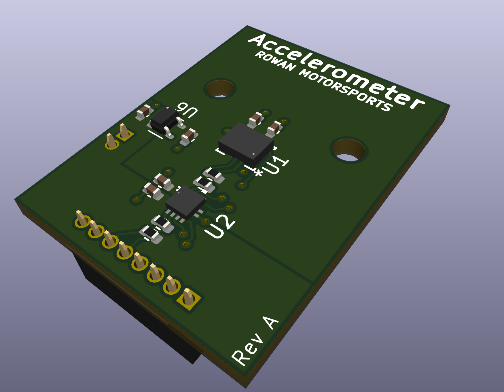
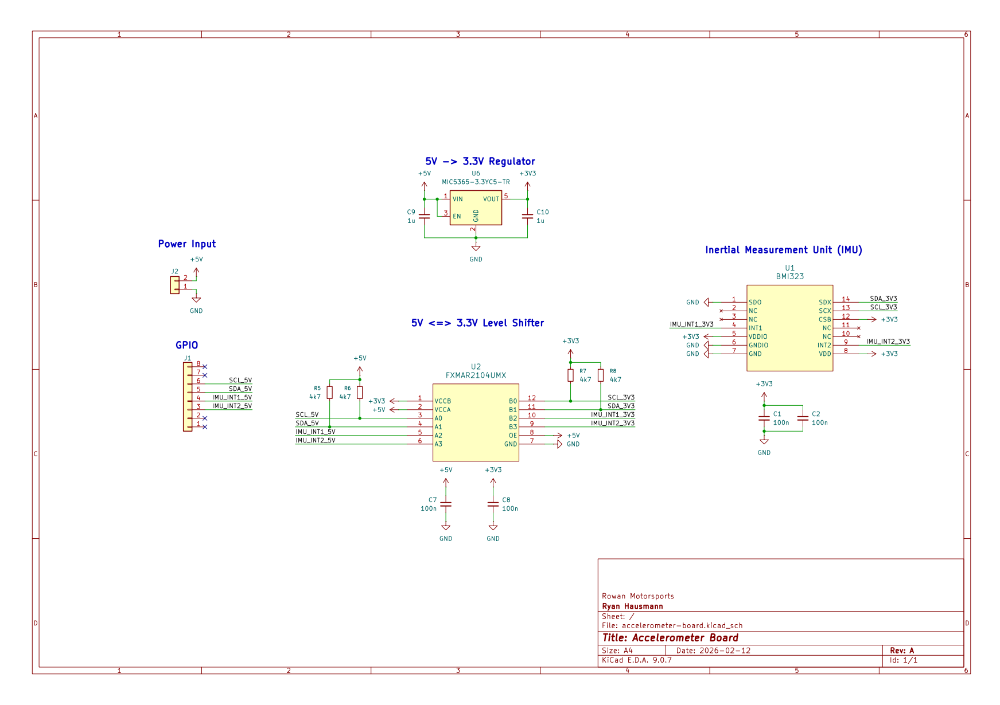

# Accelerometer Board
This board features an BMI323 inertial measurement unit w/ a 6-axis accelerometer.
It is meant to be a daughterboard for the [CAN Module](../can-module) and is able to mount to the sensor interface and be attached with 2x M2 mounting screws.
The board also features a 5V <=> 3.3V logic level converter to allow for communication between the CAN Module and the IMU.

## Schematic
Screenshot of schematic is below. Higher-quality pdf available [here](assets/schematic.pdf)

## Pins
| CAN Module | Accelerometer Board |
| ---------- | ------------------- |
| A6         | SCL                 |
| A7         | SDA                 |
| A8         | Interrupt 1         |
| A9         | Interrupt 2         |
