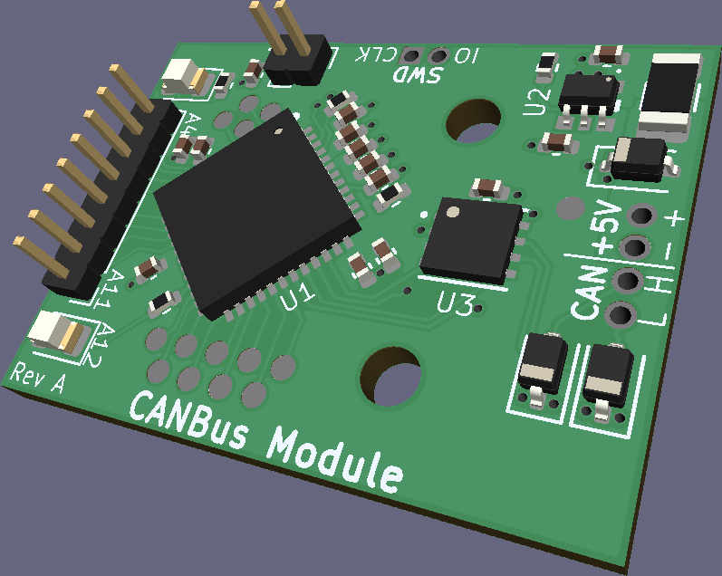
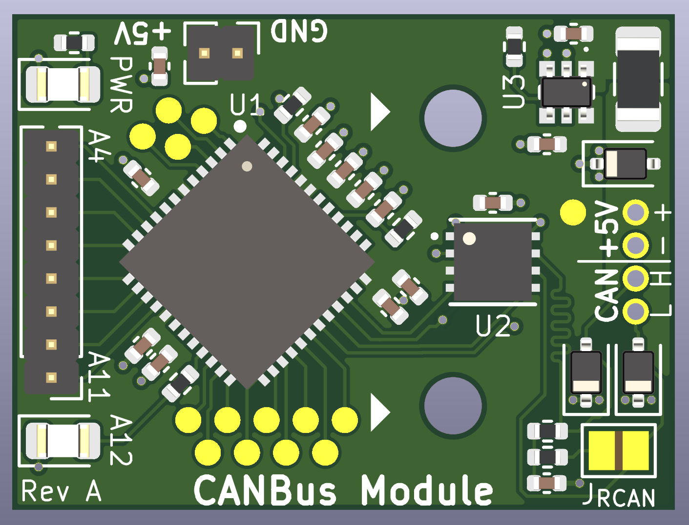
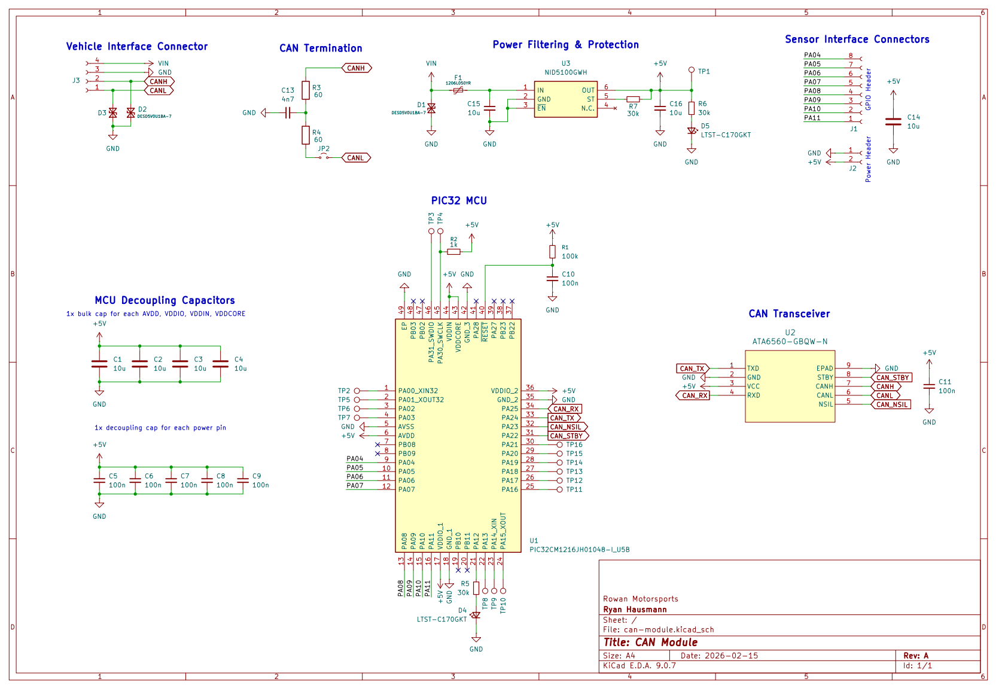
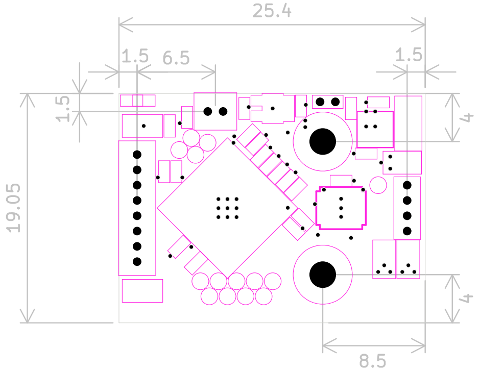
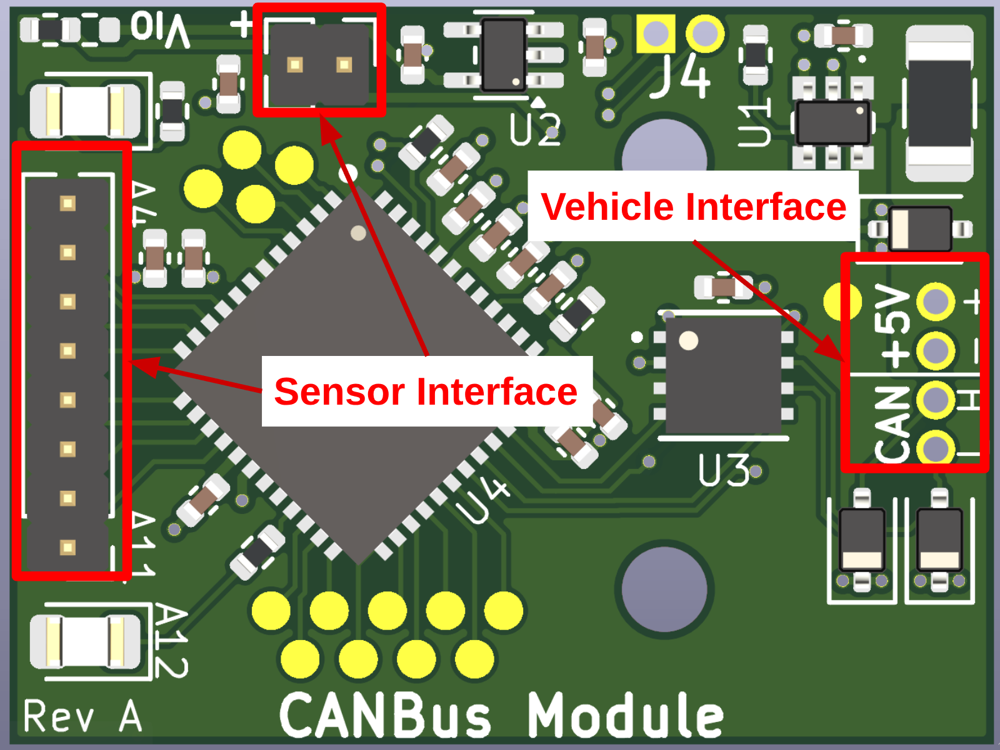

# CAN Module
The CAN Module is the main building block for the overall Data Acquisition system.
It is used as an interface between the shared [CAN Bus](https://en.wikipedia.org/wiki/CAN_bus) and each individual sensor or module around the vehicle.
This document holds all documentation about the components and usage for the CAN Module PCB.

## PCB
The CAN Module is a 1" x 0.75" printed circuit board (PCB) designed in [KiCad](https://kicad.org). All KiCad files are available in the '[pcb](pcb)' directory.

The board features a [48MHz PIC32 microcontroller](#microcontroller), a [CAN Transceiver](#can-transceiver), [headers for power and CAN communication](#vehicle-interface), as well as [8 GPIO pins](#sensor-interface).

Below shows an orthographic top and bottom view of the board:

    
    

> [!NOTE]
> If more than 8 GPIO pins are required for a particular sensor or module, an I2C GPIO expander or larger custom board design can be used.
> The CAN Module was designed to be as inexpensive as possible while still retaining a reasonable amount of features, so it does not cover every case.
> It is compatible with any CAN-FD compatible device that communicates at 5V, so options for improvements or substitutes are far from limited.

### Schematic
A schematic of the CAN Module is shown below.
Higher-quality pdf available [here](assets/schematic.pdf).

### Dimensions
The dimensions below may be of use for designing custom enclosures or daughterboards to be mounted to the CAN Module.
All dimensions are in mm, and the mounting holes are M2. Additionally, the pin headers have 0.05" (1.27mm) hole spacing.

### Power Requirements
The boards should be powered with +5V DC through the appropriate pins in the [vehicle interface](#vehicle-interface).

The total power consumption depends on attached sensors and modules, but 100-200 mA at most will be consumed by the board itself during peak power usage.

The boards feature ESD protection diodes on all pins within the vehicle interface.

> [!CAUTION]
> These boards were designed with cost as a heavy constraint. As such, some features, such as reverse polarity protection, are not present on the boards themselves. These boards, as per Baja SAE rules, should be externally fused, and caution should be taken to ensure that power is properly connected and does not exceed +5V.

### Microcontroller
The microcontroller on the CAN Module is the [PIC32CM1216JH01048-I/U5B](https://www.digikey.com/en/products/detail/microchip-technology/PIC32CM1216JH01048-I-U5B/25904014), an inexpensive and tiny 32-bit ARM microcontroller that operates at 48MHz with 128KB of flash and 16KB of RAM, as well as an embedded hardware CAN controller.
See the datasheet [here](https://ww1.microchip.com/downloads/aemDocuments/documents/MCU32/ProductDocuments/DataSheets/PIC32CM-JH00-JH01-Family-Data-Sheet-DS60001632.pdf).

### CAN Transceiver
The CAN Transceiver on the CAN Module is the [ATA6560-GBQW-N](https://www.digikey.com/en/products/detail/microchip-technology/ATA6560-GBQW-N/9453100?s=N4IgTCBcDaIIIBU4DYCsyAMBaA4gIQEUB1LAORAF0BfIA).
See the datasheet [here](https://ww1.microchip.com/downloads/en/DeviceDoc/20005991B.pdf).

### Indication LEDs
There are two indication LEDs present on the CAN Module.
One LED is a power indicator LED and is not configurable.
The other is configurable and has the anode connected through a 30k resistor to the PA12 pin on the microcontroller.

### Pins & Connectors
All pins on the CAN Module operate at 5V logic levels. There are two distinct sets of pins on the board that serve different purposes, the sensor interface, and the vehicle interface, as described and labelled below.

    

> [!WARNING]
> The headers use **0.05" (1.27mm) hole spacing** for space conservation, not the more common 0.1" (2.54mm) spacing.

#### Sensor Interface
The sensor interface is the set of 8 GPIO and 2 output power pins located on the left side of the board.
These pins are intended to provide power to and communicate with some sensor or module, or a custom-designed daughterboard which mounts on top of the CAN Module PCB.

There are two distinct pin headers in the sensor interface, one being 2 pins, and the other being 8 pins.
These are the output power and communication headers, respectively.

The output power header has a +5V output pin and GND pin, which is labelled appropriately on the board.

The communication header has 8 GPIO pins which are directly connected to GPIO pins on the [microcontroller](#microcontroller).
The pins included in this header include GPIO pins PA4 through PA11 from the microcontroller in sequential order, as labelled on the board.
These pins were selected because every one of them is capable of acting as a communication interface pin for the SERCOM peripheral on the microcontroller, see the [datasheet](https://ww1.microchip.com/downloads/aemDocuments/documents/MCU32/ProductDocuments/DataSheets/PIC32CM-JH00-JH01-Family-Data-Sheet-DS60001632.pdf) (Table 4-2) for more info.

> [!WARNING]
> These pins do not have ESD diodes, series resistors, or short circuit protection (other than what is provided by the microcontroller's GPIO pins).

#### Vehicle Interface
The vehicle interface is the set of 2 communication and 2 input power pins located on the right side of the board.
These pins are intended to provide power to the CAN Module board and allow for communication between the board and the rest of the vehicle via the shared CAN Bus.

The pins are organized as a single 4-pin header.

> [!NOTE]
> Near the vehicle interface is a solder jumper labelled JRCAN.
> This jumper is not bridged by default, and, when bridged, will allow the board to act as a bus terminator for the CAN Bus, bridging a 120Ω resistance (as well as a 4.7nF capacitor for noise suppression) across CANH and CANL.

> [!WARNING]
> Ensure that **only two** boards across the entire CAN Bus have this jumper shorted.
> Also ensure that these two boards exist at each end of the bus, see [here](https://support.maxongroup.com/hc/en-us/articles/360009241840-CAN-bus-topology-and-bus-termination) for more info.

### Programming/Debug Interface
Two serial-wire debug (SWD) pins are exposed and labelled on the back of the board.
A SWD-capable interface will be required to program the boards.

> [!NOTE]
> This is TBD, the boards have not been manufactured yet.
