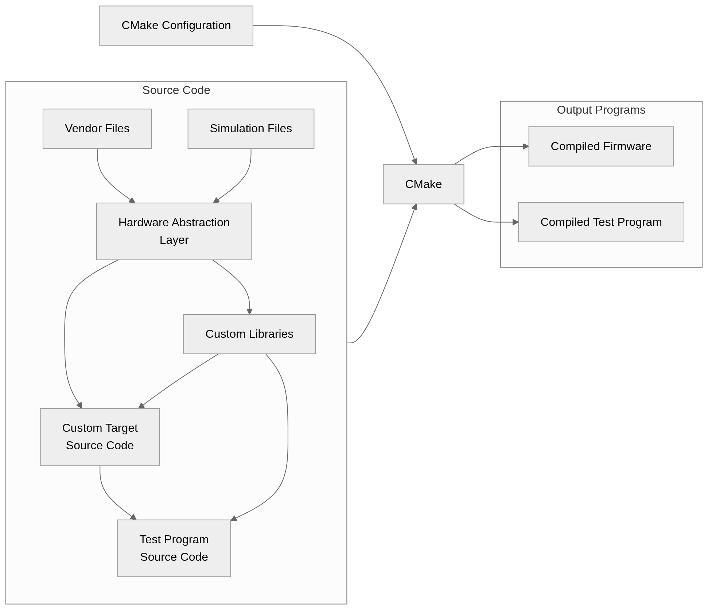

# Software
The software is written in the C programming language, and uses CMake as the build tool.

> [!NOTE]
> This has only been tested on Linux, unknown if it will work on Windows/Mac.
> If it doesn't work on Windows, you could try using [WSL](https://learn.microsoft.com/en-us/windows/wsl/install).

## Prerequisites
You will need the following:
 - [CMake](https://cmake.org/download/)
 - [XC32 Compiler](https://www.microchip.com/en-us/tools-resources/develop/mplab-xc-compilers/xc32) (for firmware only)
 - [MPLAB X IDE](https://www.microchip.com/en-us/tools-resources/develop/mplab-x-ide) (for [creating new vendor libraries](/can-module/software/vendor/mplab/README.md#creating-new-folders) only)
 - [Criterion](https://github.com/Snaipe/Criterion) (for tests only)
 - [pkg-config](https://gitlab.freedesktop.org/pkg-config/pkg-config) (for tests only)

### Quickstart on Linux
The following command can be used to install the required packages on Ubuntu or Fedora.
**Note that the XC32 compiler and MPLAB X IDE must be downloaded and installed separately from the vendor, see links above.**

#### Ubuntu
```sh
$ sudo apt install cmake libcriterion-dev pkg-config
```

#### Fedora
```sh
$ sudo dnf install cmake pkgconf-pkg-config
$ rpm -ivh https://github.com/samber/criterion-rpm-package/releases/download/2.3.3/libcriterion-devel-2.3.3-2.el7.x86_64.rpm
```
Note that there is no provided package for libcriterion by default on Fedora, so [this](https://github.com/samber/criterion-rpm-package) package is manually installed separately above.
Additionally, libcriterion is only needed for tests.

## Building
To build, run the following:

```sh
$ cmake -B build # Generates CMake files, generally only needed once (unless you edit or add new CMake configs)
$ cmake --build build -j $(nproc) # Actually builds the targets
```

This will create build files and compile the target programs in the `build` directory.

## Running Tests
This project uses the Criterion testing library, which can be ran using CTest (included with CMake).

Tests need to be built within the `tests` directory. To build the tests, run the following within the `tests` directory (same commands for regular building, just run within the `tests` directory):
```sh
$ cmake -B build
$ cmake --build build -j $(nproc)
```

To run tests, run the following:

```sh
$ ctest --test-dir build
```

## Flashing to hardware
### Debugger
I used the [MPLAB SNAP](https://www.microchip.com/en-us/development-tool/pg164100) programmer/debugger connected to the SWD pins on the CAN module.

See Table 3.3.1 in the [user manual](https://ww1.microchip.com/downloads/aemDocuments/documents/DEV/ProductDocuments/UserGuides/MPLAB-Snap-In-Circuit-Debugger-User-Guide-50002787.pdf) to see the pinout needed for SWD. 

Note that the MPLAB SNAP will **not** provide power to the CAN Module, and it needs a voltage reference (5V) connected to the VDD pin. I made a simple wire harness to connect a +5V source to the VDD pin on the MPLAB SNAP and the +5V pin on the CAN Module, as well as connect all grounds. I also added wires to connect the SWDIO and SWCLK pins together between the MPLAB SNAP and CAN Module.

### How to flash
I used the MPLAB IPE software to flash the generated hex file in the `build` directory to the microcontroller.

Simply select the device as a `PIC32CM1216JH01048`, select the hex file for the target (located in `build` as `[name].hex`), then click 'Program'.

## Project Structure
This section contains a little bit of information about how the software is structured for this project.

There are several directories here which contain source code files which do different things, being `vendor`, `hal`, `lib`, `targets`, and `tests`.

The `vendor` directory contains files provided by or generated by vendor tools. For example, board template headers generated by MPLAB X IDE are in this folder.

The `hal` directory contains the Hardware Abstraction Layer (HAL) files. These allow for the same program to be run on different platforms, for example, the same program can be run on the CAN Module's microcontroller and also be run in simulation. Each HAL library contains a single header (`.h`) which is included in programs or libraries and a C source file (`.c`) for each implementation. Then, when compiling, CMake automatically links the correct implementation to each platform, ensuring compatability across platforms.

The `lib` directory contains helper libraries that build on the HAL libraries. For example, maybe a library for reading from a specific sensor or writing to an SD card, etc.

The `targets` directory contains each individual target program source code. This has the 'main' function for each program being built. For example, a particular target could use both of the aforementioned libraries to read from a sensor and write the data to an SD card. However, this varies since different targets will need to do different things. Regardless, the automated CMake build process will automatically compile a separate firmware binary for every target.

Finally, the `tests` directory contains software simulation test files for ensuring that everything works.

The below diagram shows what source files get used by other sources. We can see that the HAL uses vendor files and simulation files. Then, we can see that the HAL functions get called in custom libraries or by targets. Note that libraries and targets never call vendor or simulation functions directly, it is always through the HAL to ensure cross-platform compatibility. Finally, we see that test programs may call functions from custom targets or custom libraries.


