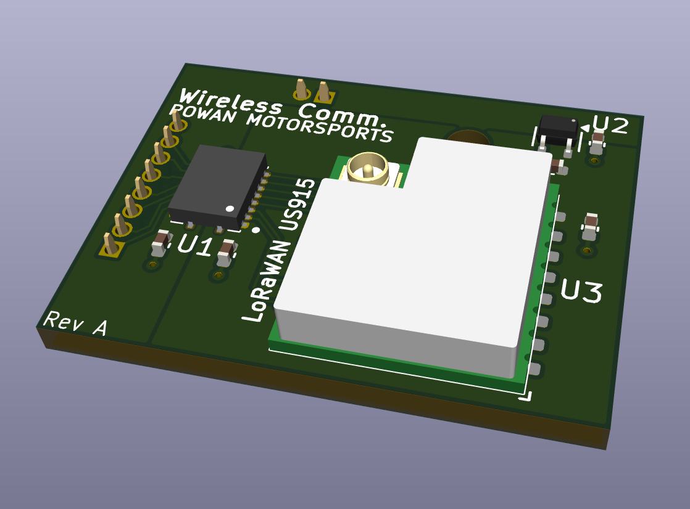
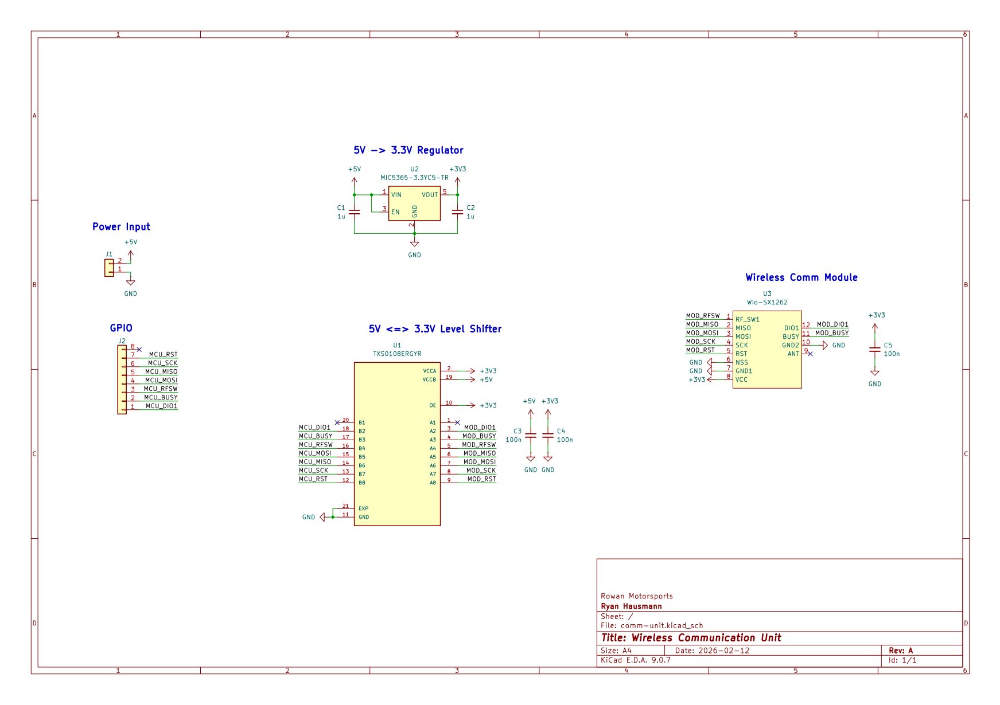

# Wireless Communication Unit
This board features a [Wio-SX1262](https://www.seeedstudio.com/Wio-SX1262-Wireless-Module-p-5981.html?srsltid=AfmBOoqZmrf0CEVK_4ujwWH4PZOS86moPJ_168C79Yj0bSZ9xbsUhzyb) LoRa module and is used to wirelessly transmit sensor data over long distances (3-5km).
It is designed to be a daughterboard for the [CAN Module](../can-module) and mounts on top of it via the sensor interface.

## Schematic
A screenshot of the schematic is below. A higher-quality pdf is available [here](assets/schematic.pdf).

## Pins
| CAN Module | Comm Unit |
| ---------- | --------- |
| A4         | N/C       |
| A5         | NRST      |
| A6         | SCK       |
| A7         | MISO      |
| A8         | MOSI      |
| A9         | RFSW      |
| A10        | BUSY      |
| A11        | DIO1      |
