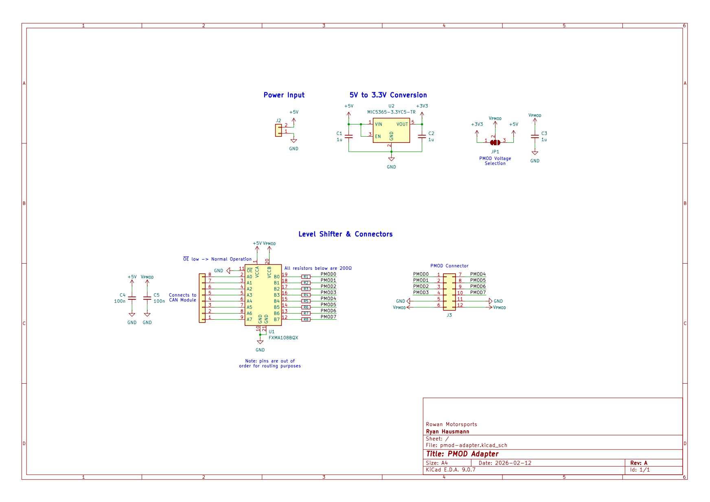
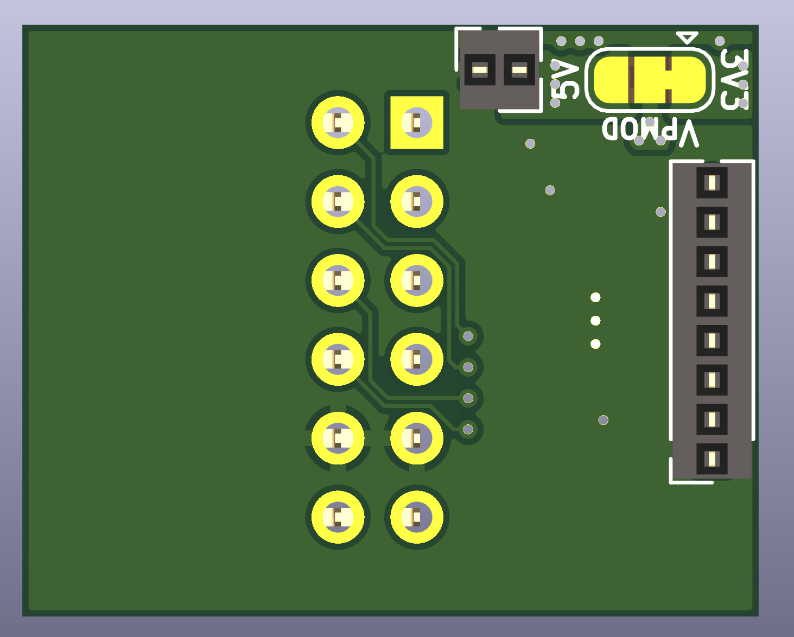

# PMOD Adapter
The PMOD adapter is meant to be a daughterboard for the [CAN Module](../can-module).
It is meant to act as an adapter board to convert the 5V logic from the CAN Module into 3.3V logic for the [PMOD interface](https://en.wikipedia.org/wiki/Pmod_Interface) (see the spec [here](https://digilent.com/reference/_media/reference/pmod/pmod-interface-specification-1_2_0.pdf?srsltid=AfmBOopyBuaw-eLZASs9BrwRv7mYRkTEZ4E9nGXd7mhXq3Ivtdyv9wY3)), which is commonly used in many [Digilent sensor boards](https://digilent.com/shop/products/fpga-boards/expansion-modules/pmods).
This helps save time when a single sensor needs to be used and it would be impractical to design a custom board just for that, making it easier to simply plug in a PMOD board.

## Schematic
Screenshot of schematic is below. Higher quality pdf available [here](assets/schematic.pdf).

## Mounting to CAN Module
This board can mount directly onto the sensor interface of the CAN Module via female headers on the bottom of the board.
Note that, due to size constraints, this board does not feature M2 mounting holes.

## Changing the Logic Level
This board supports changing the logic level via a selectable solder bridge on the bottom of the board.
See the top right in the screenshot below:

> [!CAUTION]
> Note: When switching the logic level to 5V or something else, note that **the 3.3V bridge will have to be disconnected!!** Otherwise, this bridge will dead-short 5V to 3.3V.
