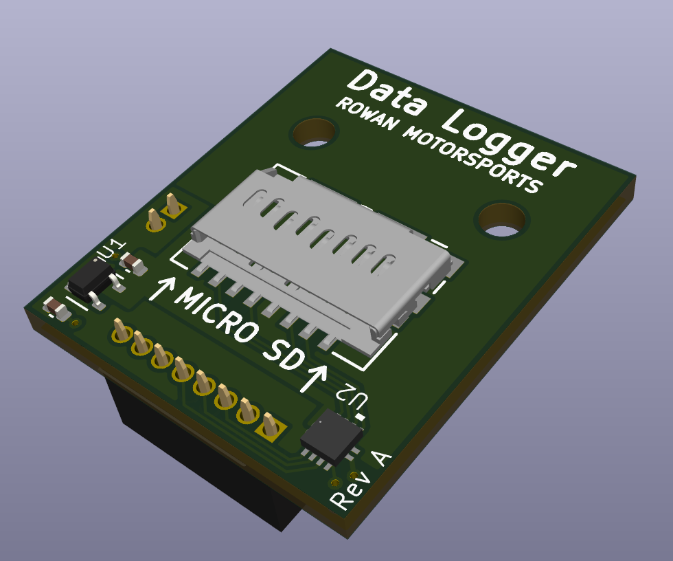
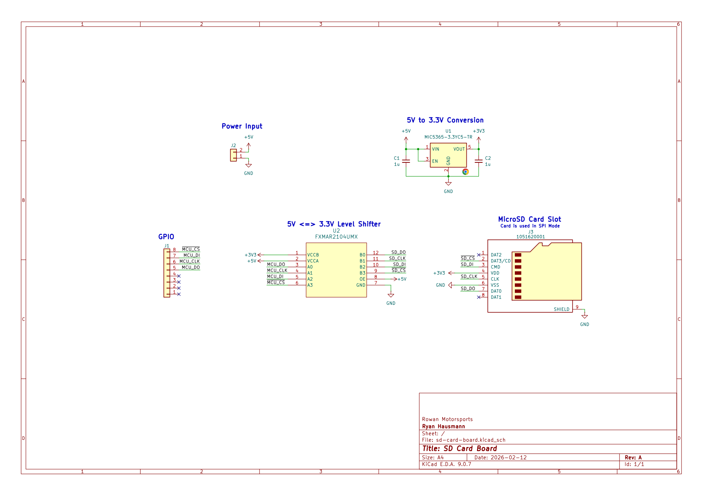

# SD Card Board
This board is a small data logger board that is designed to mount as a daughterboard for the [CAN Module](../can-module).
A microSD card can be inserted into it and the CAN Module will be able to communicate with the card.
The board features a 5V <=> 3.3V logic level converter to allow communication between the CAN Module and the microSD card.

> [!NOTE]
> The SD card will be operating in SPI mode, so data bandwidth will be somewhat limited.

## Schematic
A screenshot of the schematic is below, a higher-quality pdf is available [here](assets/schematic.pdf).

## Pins
| CAN Module | SD Card Board |
| ---------- | ------------- |
| A4         | CSn           |
| A5         | DI            |
| A6         | CLK           |
| A7         | DO            |
| A8         | N/C           |
| A9         | N/C           |
| A10        | N/C           |
| A11        | N/C           |
